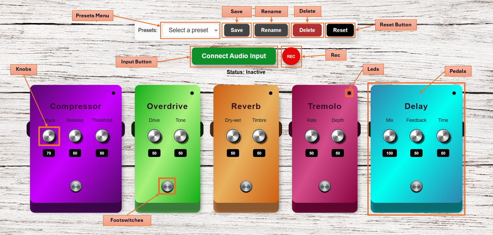

   
# ACTAM PROJECT 2024/25

Hi! We are Andrea Antognetti and Matteo Di Giovanni and this is the repo containing the project we developed for the [“**Advanced Coding Tools And Methodologies**”](https://www4.ceda.polimi.it/manifesti/manifesti/controller/ManifestoPublic.do?EVN_DETTAGLIO_RIGA_MANIFESTO=evento&aa=2024&k_cf=225&k_corso_la=263&k_indir=MMI&codDescr=052828&lang=IT&semestre=1&anno_corso=1&idItemOfferta=168526&idRiga=307212) course examination in the **Music Engineering** Master’s degree program at Politecnico di Milano (**Polimi**).

To have a look at the final result and play with it open this [link](https://matteodigii.github.io/ACTAM-Project/Guitar-Pedalboard/).

You can also find a demo made using only built-in presets [here](https://youtu.be/fFXlPjDkMTU).

### Main Purposes of the App
Grant the user the possibility to experiment with lots of sound combinations and perform live.

## 1.0 User Instructions
### How to set up your environment

To correctly use and enjoy our pedalboard functionalities you will need:
-  An **Audio Interface**: we did everything with the [**Steinberg UR22mkII**](https://www.steinberg.net/audio-interfaces/ur22c-recording-pack/ur22mkii/value-edition/), that has 24-bit/196kHz audio resolution.
- An **Instrument**: conventionally we would say a guitar, but feel free to try also with any sort of electric instrument that has a jack/cannon output linking like a piano or a microphone (in this case be sure to use headphones to avoid feedback in acquiring the audio input also from the processed version).
-  Any kind of **laptop** that supports **USB Audio Interfaces**.

Regarding which Browser to choose we strongly recommend using **Google Chrome**, as all the testing occurred there.

### Functionalities Overview
In building our model Graphic User Interface (**GUI**) we focused on the main aspects that characterize good User Experience (**UX**) for this type of Web Application:
-	**Intuitivity**, getting at first sight what are the capabilities offered from the App and how to use them;
-	**Flexibility**, being able to display pedals in the way you prefer.
-	**Customization**, having the possibility to save personal presets in your local storage to reuse later instead of just the default provided ones;

Here you can see a detailed snapshot of the project:

**Pedals**

Designed paying attention to the newest trends in audio processing while still maintaining an overall traditional look. 

Each one of them emulates a specific guitar-type effect, there are five of them, two pre-processors, a modulation and two ambient ones: 
-	**Compressor**, speaks for itself.
-	**Overdrive**, distorts the sound ranging from mild booster to acid 70s "Led Zeppelin" type sound.
-	**Reverb**, adds a nice lasting tail to your sound, seems to be in a concert hall right?.
-	**Tremolo**, emulates a typical 60s surfing/waving sound to enrich your sound palette.
-	**Delay**, adds delay repetition to your input signal, the cherry on the top.

**Knobs**

With whom you can control and adjust all pedal parameters.

**FootSwitches**

Allows the user to dynamically update the signal chain, deciding whether or not turn on a specific pedal.

**Leds**

Will help the user to understand the state of a specific pedal.

**Input Button**

Avoids unwanted clipping and feedback when accessing the page and allows the user to decide whenever to start hearing input sound.

**Reset Button**

Are you unsure of the changes you made? Don’t worry, we have the right solution for you. Pressing this button will take care of everything, restoring all the default settings.

**Presets Menu**

Here it’s possible to find all our custom build presets to have a first try at the pedalboard and then find your presets when you start making and saving them.

**Save**

With this button you can save your pedalboard status and then name with something cool. You just made a preset, fun indeed!

**Delete**

Have you changed idea regarding a preset? Clicking this button will make it disappear! 

But pay attention, you cannot use it to cancel our presets, it would be rude, right?

**Rec**

Would like to make your friends hear the wonderful sounds you made with this app? Now you can!  

## 1.1 Code Implementation
We subdivided our backend structure in three different script: **Motion**, **Presets**, **Audio**.

### Motion 

Handles all possible user interaction with the pedalboard, updating dynamically knob values, footswitch status, and pedal positions (yes, you can drag and drop them to have a customized look).

It also sets up the Reset Button since it’s strictly linked to the overall view of the page.

### Presets

Initializes the Preset menu and allows the user to write and delete new presets saving them in the local storage of your browser.

### Audio

Generates a new Audiocontext (latencyhint is set to ‘interactive’ since this app is meant to be used in real time and needs adaptive adjusting) each time the Input button is clicked and starts the processing, if something fails an error will be displayed on the user screen.

Firstly, we acquire the sound from the audio interface with specific parameters: 
-	very **low latency** (not 0 since we do not want to overload the browser), 
-	**echo cancellation** set to 'false' (extremely important to avoid automatic gain adjustment from the Browser),
-	same **sampling frequency** as the Audiocontext chosen one (48kHz);

We then create a stream of data from this audio flux to later manipulate.

At this stage we also load the Reverb Impulse Response (**IR**) with whom we fill a specific buffer to be used later in the reverb function.

We are now ready to call for the first time the **updateChain(audioContext, input)** function to connect the audio input to the output speakers (or headphones if you’re using them).

We added some events to make sure that this function is called each time the user changes the list of active pedals, hits the reset button or decides to change the current preset.

### Other tools
The only libraries employed for this project are "**webaudio-controls**" and "**Sortable**", that we found very useful to shape knobs and switch and to implement the drag and drop process. 

The rest is entirely made relying on "**Web Audio API**" (referring specifically to effects design).

## 1.2 Latency
Regarding Latency we can confidently say it’s possible to obtain good outcomes if playing single notes or slow strummed chords. 

Whenever increasing speed of playing, it starts to get messy and it could arise the risks that the player gets confused, not being able to play correctly. 

With some simple measurements we found that latency oscillates around 9-10ms for the acquired input signal, which is acceptable, but still noticeable, even though for live performance purposes it would be better to achieve a maximum of 5ms. 

Considering that we’re not only acquiring the input but also processing it, latency will tend to incrase (depending also on the number of active pedals) making this result pretty much impossible to achieve.

It's also important to stress that latency cannot be totally eliminated in such type of applications.

However it could be lowered depending on the quality of the used hardware, the ADC in the Audio Interface: in fact we saw better overall performances with the Steinberger rather than with the Scarlett (model specified below). 

## 2. Possible Improvements
- Adding a **login policy** to allow registered users to save in an external Server their custom made preset so that only them using a different laptop can access those.

- Developing more pedals and implement the possibility for the user to choose which of them to add in his customized pedalboard.

- Testing also on other audio interfaces and browsers to ensure compatibility. At the moment, only **Steinberg UR22mkII**, **Scarlett Solo Gen3**, as audio interfaces, and **Google Chrome**, as browser, are taken into account (the latter because it’s the most world-wide spread one).

## About us
| Name                                                  | Email                         |
| ---------------------------------------------------------- |:-----------------------------:|
| Matteo Di Giovanni | matteo.digiovanni@mail.polimi.it  |
| Andrea Antognetti | andrea.antognetti@mail.polimi.it  |

